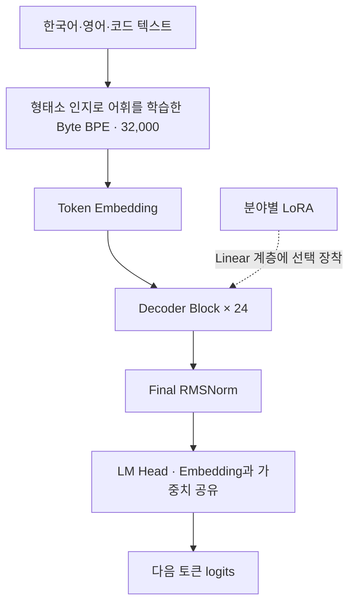

# 한국어 LLM 아키텍처 v1

조사·설계일: 2026-09-17. 후속 구현: **기본 모델·토크나이저·학습·LoRA/DoRA 코드와 동작 검증 완료, 한국어 본 학습 전**. [실행 범위와 검증 결과](implementation.md)를 우선한다. 아래 후속 계획 중 미구현 확장도 이 안내에서 구분한다.

## 1. 설계 결정

이 저장소의 목표인 **직접 사전학습하는 한국어 기본 모델 + 분야별 어댑터**에는 Dense Decoder-only Transformer를 기본안으로 채택한다. 핵심은 **전 구간 causal GQA, Pre-RMSNorm, headwise QK-RMSNorm, RoPE, SwiGLU, 입력·출력 embedding 공유**다. 우리가 읽은 HyperCLOVA·Polyglot-Ko의 한국어 입력 처리와 OLMo·OLMo 2의 모델·학습 원칙을 조합한다. [논문별 채택 근거와 한국어 학습 설계](korean-model-recipe.md)가 그 연결을 정의한다. 정확한 Pre/headwise norm 조합에는 [Qwen3 §2](https://arxiv.org/html/2505.09388v1#S2)를 보조 참고했으며 OLMo 2를 그대로 복제한 구조는 아니다. 모델 크기·어휘·문맥 길이는 프로젝트 제안이다.

현재 모든 작업·예산에서 가장 좋은 단일 구조가 입증된 것은 아니다. 여기서는 한국어 품질, 직접 구현·검증 가능성, 추론 메모리, LoRA 확장성을 함께 우선한다. GPU 수·VRAM·학습 시간·데이터량은 미확정이므로 316M은 본 학습을 승인한 크기가 아니라 설계 기준이다. 품질은 데이터와 학습 예산에도 크게 좌우된다.

기존 [첫 설계](model-design.md)의 MHA 중심 약 50M 구성은 초기 학습 노트로 보존한다. 이후 구현의 구조 기준은 이 문서와 `configs/architecture/*.json`이다. 기존 개발 기획의 일정과 데이터 예산은 새 모델 크기에 맞춰 별도로 재산정해야 한다.

## 2. 전체 구조



블록 하나의 순서를 고정한다. 두 residual은 순차적으로 연결한다.

```text
u = RMSNorm_attn(x)
q = reshape(q_proj(u)); k = reshape(k_proj(u)); v = reshape(v_proj(u))
q = RMSNorm_q(q); k = RMSNorm_k(k)      # 마지막 head_dim 축
q, k = RoPE(q, k, position_ids)        # norm 다음, V에는 적용하지 않음
a = GQA(q, k, v, causal_document_mask)
y = x + o_proj(concat_heads(a))
z = RMSNorm_ffn(y)
output = y + down_proj(silu(gate_proj(z)) * up_proj(z))
```

QK-Norm은 각 head의 마지막 축에 적용하며 Q용·K용 scale 각각 `[head_dim]`을 head들끼리 공유한다. 모든 Q head를 합친 축에 norm을 적용하는 OLMo 방식과 구별한다. 순서와 scale 형태는 [Transformers Qwen3 구현](https://github.com/huggingface/transformers/blob/main/src/transformers/models/qwen3/modeling_qwen3.py)을 참고했다. bias는 모든 projection에서 사용하지 않는다.

## 3. 크기별 설계 명세

| 항목 | debug-40m | base-316m · 기준안 | scale-1.2b · 자원 확보 후 |
|---|---:|---:|---:|
| 어휘 크기 V | 32,000 | 32,000 | 32,000 |
| 레이어 수 L | 8 | 24 | 24 |
| Hidden size d | 512 | 1,024 | 2,048 |
| Query heads Hq | 8 | 16 | 16 |
| KV heads Hkv | 4 | 8 | 8 |
| Head dimension h | 64 | 64 | 128 |
| SwiGLU 내부 폭 f | 1,408 | 2,816 | 5,632 |
| 설계 문맥 길이 | 1,024 | 4,096 | 4,096 |
| 파라미터 수 | 39,986,688 | 315,936,768 | 1,198,104,576 |

공통 설정: `rms_norm_eps=1e-6`, `rope_theta=10000`, 전체 head_dim에 RoPE, `rope_scaling=null`, attention/FFN dropout=0, embedding 공유, FFN=dense SwiGLU. 수치는 **논문 그대로의 모델이 아닌 프로젝트 출발값**이다. QK-Norm은 안정성을 위한 초기 선택이며 끈 모델과 반드시 비교한다. 문맥 길이는 학습·평가 목표이지 현재 처리 능력의 실측치가 아니다.

GQA 비율은 Hq/Hkv=2로 시작한다. 극단적으로 KV head를 줄이기보다 메모리와 표현력 사이의 균형을 택한 프로젝트 판단이다. `Hkv=Hq`를 설정하면 MHA 대조군이 된다. 변경 시 K/V 가중치 모양이 바뀌므로 기존 checkpoint와 바로 교환할 수 없다.

## 4. 구성 요소 선택 이유

| 요소 | 결정과 기대 효과 | 한계·비교 항목 |
|---|---|---|
| Dense FFN | 모든 토큰이 같은 FFN을 사용; 작은 모델의 학습·어댑터 관리 단순화 | MoE보다 항상 품질이 좋다는 뜻은 아님 |
| GQA | KV head 공유로 KV cache 감소; [GQA 논문](https://arxiv.org/abs/2305.13245) | 장문 품질 손실 가능; MHA와 비교 |
| 전 구간 causal attention | 각 층에서 문서 내 모든 이전 토큰 참조 | 학습 attention 연산은 여전히 길이에 대해 이차 증가 |
| Pre-RMSNorm | attention·FFN 입력 정규화; [RMSNorm](https://arxiv.org/abs/1910.07467) | 깊이 확장 시 초기화·수치 안정성 재검증 |
| Headwise QK-Norm | attention logits 안정성용 초기 선택; Qwen3 사례 | 장문 확장에 항상 유리하지 않음 |
| RoPE | Q/K에 위치 정보 적용; [RoFormer](https://arxiv.org/abs/2104.09864) | theta만 바꿔 장문 성능을 보장할 수 없음 |
| SwiGLU | gate와 비선형 FFN; [GLU Variants](https://arxiv.org/abs/2002.05202) | FFN 폭은 동일 예산에서 비교 필요 |
| Weight tying | 작은 모델의 embedding 비용 절약 | untied head와 품질 비교 가능 |
| SDPA/FlashAttention | 같은 attention을 효율적으로 실행하는 backend | 모델 구조 자체가 아니며 kernel 지원 확인 필요 |

[OlmPool 연구](https://allenai.org/papers/olmpool)는 GQA·QK-Norm·sliding window·짧은 사전학습 문맥의 조합이 장문 확장 성능을 저하시킬 수 있음을 보여준다. 해당 결과는 주로 7B급 실험이므로 우리 316M의 효과 크기로 일반화하지 않는다. 기본안에는 sliding window를 넣지 않으며, QK-Norm 유무와 KV head 수를 독립적으로 실험한다. 짧은 문맥 validation loss만으로 장문 품질을 판단하지 않는다.

## 5. 텐서·추론 계약

기준안에서 B=batch, T=현재 입력 길이, S=cache에 저장된 이전 길이다.

| 위치 | Shape |
|---|---|
| input_ids / position_ids | `[B,T]` |
| hidden states | `[B,T,1024]` |
| q_proj.weight / o_proj.weight | `[1024,1024]` |
| k_proj.weight / v_proj.weight | `[512,1024]` |
| Q / K / V | `[B,16,T,64]` / `[B,8,T,64]` / `[B,8,T,64]` |
| 각 층 KV cache | K와 V 각각 `[B,8,S+T,64]` |
| gate_proj.weight / up_proj.weight | `[2816,1024]` |
| down_proj.weight | `[1024,2816]` |
| 공유 embedding / lm_head.weight | `[32000,1024]` |
| logits | `[B,T,32000]` |

PyTorch Linear의 `[out_features,in_features]` 표기다. Q head i는 KV head `floor(i / (Hq/Hkv))`를 참조한다. cache는 RoPE 적용 후 K와 원래 V만 저장하며, 반복 확장한 K/V를 영구 저장하지 않는다.

계획 API는 `forward(input_ids, attention_mask=None, position_ids=None, past_key_values=None, use_cache=False)`이며 `{logits, past_key_values}`를 반환한다. loss 계산과 sampling은 별도 모듈이다. 학습은 cache를 끄고, 추론은 prefill 뒤 새 토큰만 decode한다. cache의 문맥 상한을 초과하면 명시적으로 오류를 반환한다.

causal mask는 **절대 위치 key_position <= query_position**으로 정의한다. 특히 S>0인 cached decode에서 정방 행렬용 causal mask를 그대로 재사용하면 안 된다. padding key는 차단하고, 패딩 query 출력은 loss에서 제외한다. 서로 독립된 문서를 packing하면 document id가 같은 토큰끼리만 attention을 허용한다. 문서마다 position을 0으로 재시작하고 문서 경계를 넘는 label도 제외한다. EOS만 넣는 것은 문서 격리가 아니다.

정답은 한 칸 오른쪽 토큰이다. trainer가 `logits[:,:-1]`와 `input_ids[:,1:]`로 cross entropy를 계산하며 패딩·문서 경계의 target은 `ignore_index=-100`으로 처리한다. shift는 한 번만 수행한다. 유효 target이 없는 batch는 건너뛴다.

## 6. 토크나이저와 어댑터 경계

토크나이저는 **MeCab-ko 경계로 어휘를 학습한 형태소 인지 Byte-level BPE**를 기본안으로 둔다. 256개 byte alphabet을 전부 포함하며 SentencePiece식 byte fallback과 구분한다. 32,000은 byte alphabet과 special token을 포함한 최종 ID/embedding 행 수다. 모델 학습용 인코딩과 추론은 같은 ByteLevel 규칙을 사용하며 기본안에서는 MeCab을 실행하지 않는다. 원문 보존과 학습·추론 차이의 정확한 계약은 [한국어 설계 §2](korean-model-recipe.md)에 정의했다. BOS/EOS/PAD/UNK 및 대화 구분 token은 어휘 학습 전에 예약한다. 기존 `tokenizer/char.py`는 검증용이며 32K BPE처럼 취급하지 않는다.

일반 byte BPE 32K, 형태소 인지 어휘 학습 32K/48K, 추론에도 형태소 경계를 강제한 후보를 비교한다. 문장당 토큰 수, byte당 loss, 숫자·띄어쓰기·한영 혼합·전문용어 보존을 평가한다. 서로 다른 tokenizer의 token perplexity를 직접 비교하지 않는다. 형태소 인지 방식이 모든 작업에 우월하다고 가정하지 않는다.

분야별 LoRA는 `q_proj,k_proj,v_proj,o_proj,gate_proj,up_proj,down_proj`에 연결할 수 있도록 이름을 고정한다. base 구조에 LoRA를 내장하지 않고 `adapters/`가 Linear를 감싼다. rank/alpha는 어댑터 설정이며 base 파라미터 수에 포함하지 않는다. LoRA의 근거는 [원 논문](https://arxiv.org/abs/2106.09685)이다.

adapter manifest에는 base checkpoint hash, architecture config hash, tokenizer hash, target modules, rank/alpha, dtype, adapter version을 저장한다. 하나라도 불일치하면 로딩을 거절한다. 분야를 바꿀 때 base를 재학습하지 않고 adapter를 교체하며 기존 cache는 폐기한다. QLoRA는 이후 양자화·학습 backend 선택으로 다룬다.

## 7. 메모리 산식

위 설정의 정확한 파라미터 수는 다음과 같다. norm scale만 있고 bias는 없으며, Q/K norm은 각각 h개의 학습 scale을 갖는다.

```text
P = V*d + L*(2*d*Hq*h + 2*d*Hkv*h + 3*d*f + 2*d + 2*h) + d
KV_bytes = 2 * L * B * cached_tokens * Hkv * h * bytes_per_element
```

| 설계 | BF16 가중치만 | AdamW 상태 포함 예시 · 16 bytes/P | BF16 KV · B=1, 표의 문맥 길이 |
|---|---:|---:|---:|
| debug-40m | 0.074 GiB | 0.596 GiB | 8 MiB |
| base-316m | 0.588 GiB | 4.708 GiB | 192 MiB |
| scale-1.2b | 2.232 GiB | 17.853 GiB | 384 MiB |

16 bytes/P는 BF16 weight 2 + BF16 gradient 2 + FP32 master weight 4 + FP32 Adam moments 8을 가정한 예시다. 실제 optimizer 구현에 따라 달라지며 activation, logits, 임시 workspace, allocator 여유분은 제외했다. 따라서 위 표는 필요한 GPU VRAM 전체가 아니다. cache가 없는 학습과 cache가 있는 추론 메모리를 단순 합산하지 않는다. 기준안의 MHA KV는 같은 조건에서 384 MiB이므로 GQA는 KV 저장량을 절반으로 줄인다. 총 추론 메모리·지연이 절반이 된다는 뜻은 아니다.

## 8. 최신 구조와 확장 경로

| 후보 | 확인한 근거 | 이 프로젝트의 판단 |
|---|---|---|
| Dense GQA Transformer | Qwen3 논문과 실제 projection/norm 코드 | 기본안; 짧거나 중간 문맥의 소형 모델 기준 |
| Gated DeltaNet + full attention | Gated Delta Networks, Qwen3.5 계열, 최신 Qwen3.8-27B config | 장문·decode 메모리가 병목이면 실험 |
| MoE | DeepSeek-V3, Qwen3 MoE | expert weight 메모리·routing·분산 통신 예산 확보 후 |
| MLA + DeepSeek Sparse Attention | DeepSeek-V3 / V3.2 | 대규모 장문 추론을 위한 별도 설계 후보 |

하이브리드 실험안은 `DeltaNet → DeltaNet → DeltaNet → full attention`을 반복하고 각 mixer 뒤에 Dense SwiGLU를 둔다. 이는 최신 계열에서 확인한 패턴을 바탕으로 한 후속 후보다. 아직 recurrence/state 크기와 kernel 계약을 확정하지 않았으므로 실행 가능한 config로 제공하지 않는다. 채택 시 full-attention KV 외에 DeltaNet recurrent state와 convolution state를 별도로 관리해야 하며, 문서 경계·요청 경계에서 모두 초기화해야 한다. 기존 Dense checkpoint를 설정만 바꿔 하이브리드로 변환하지 않는다.

MoE는 토큰당 활성 파라미터를 줄여도 전체 expert 가중치 저장이 필요하다. DeepSeek-V3.2의 sparse attention 또한 우리 크기에 맞는 속도·품질 이득을 측정하기 전에는 적용하지 않는다. 서로 다른 모델의 공개 benchmark 차이를 구조 하나의 인과 효과로 해석하지 않는다. 최신 확인 범위와 링크는 [조사 기록](papers/architecture-research-2026-09.md)에 정리했다.

## 9. 후속 구현 경계와 검증 기준

구현 파일은 [model/README.md](../model/README.md)에 정리했다. 아래 항목은 구현의 검증 기준이며 실제 통과 결과와 남은 확장은 [구현 안내](implementation.md)에 기록했다.

후속 구현 시 먼저 작은 임의 가중치 모델에서 검증한다.

1. 미래 토큰을 바꿔도 이전 위치 logits가 변하지 않는 causal 검증.
2. 전체 forward와 prefill+token-by-token decode logits 일치: FP32부터 확인하고 BF16은 오차 기준을 별도 기록.
3. padding·packing에서 다른 문서 내용이 logits/loss에 영향을 주지 않는지 확인.
4. embedding/head가 실제 같은 Parameter인지, 파라미터 수가 산식과 같은지 확인.
5. 저장·복원 후 logits 일치, LoRA 비활성화 시 base 출력 복원, 다른 adapter 전환 시 cache 폐기 확인.
6. eager attention 기준과 SDPA/FlashAttention 결과·gradient 비교 후 가속 backend 채택.

구조 선택 실험은 데이터·tokenizer·학습 토큰·seed를 통제해 MHA/GQA와 QK-Norm on/off를 비교한다. shape 고정 비교와 파라미터/FLOPs를 맞춘 비교를 구별한다. 한국어 validation, 분야 작업, 장문 검색·다중 근거 이해, 메모리, prefill/decode 지연을 함께 기록한다. 작은 모델 실험 통과가 큰 모델의 성능 보장은 아니다.

40M에서 정합성과 학습 흐름을 확인한 뒤 316M의 실제 처리량·메모리를 측정하고 본 학습 예산을 산정한다. 1.2B는 그 결과에 따른 확장 선택지다. 구조만으로 한국어 능력이나 분야 성능을 보장하지 않는다.
