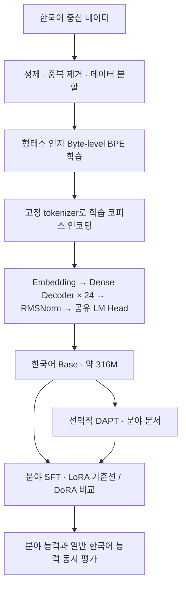

# 우리가 읽은 논문으로 구성한 한국어 LLM 설계

2026-09-17 · 설계 명세. 후속으로 기본 구현·동작 검증을 완료했다. [구현 안내](implementation.md)에서 실행 방법과 실제 지원 범위를 확인한다. 본 학습·한국어 품질 검증은 아직 수행하지 않았다.

## 1. 채택 구조와 논문별 역할

**한국어 입력 처리는 HyperCLOVA·Polyglot-Ko, 모델과 학습 안정화는 OLMo·OLMo 2, 분야 적응은 DAPT·LoRA·DoRA를 중심으로 설계한다.** 최신 모델은 세부 구현과 비교의 보조 근거다. 하나의 논문을 그대로 복제한 모델은 아니며, 아래 표가 조합한 부분을 명시한다.



| 읽은 논문 | 가져오는 요소 | 그대로 가져오지 않는 요소 |
|---|---|---|
| Attention Is All You Need | causal attention·residual의 기반 | 번역용 encoder-decoder 전체 |
| HyperCLOVA | 형태소 인지 Byte-level BPE, 한국어 중심 데이터, AdamW·cosine, p-tuning 비교 아이디어 | 비공개 분석기, 대규모 GPU/배치 수치 |
| Polyglot-Ko | MeCab 기반 tokenizer 학습, 한국어 정제, RoPE, 한국어 평가 | GPT-NeoX의 GELU·parallel residual·LayerNorm 전체 복제 |
| OLMo | Dense decoder, SwiGLU, RoPE, no bias, 작은 모델의 weight tying, AdamW | 영어 중심 tokenizer·데이터 비율 |
| OLMo 2 | RMSNorm·QK-Norm의 안정화 아이디어, embedding decay 제외, AdamW epsilon, Z-loss 비교 | output norm·layerwise QK-Norm·대규모 레시피의 무조건 이식 |
| Don't Stop Pretraining | 분야/작업의 비라벨 데이터로 추가 적응 | 원 논문의 RoBERTa MLM objective |
| LoRA / QLoRA / DoRA | 저비용 분야 적응과 비교 체계 | base 사전학습을 4-bit adapter 학습으로 대체 |

블록의 정확한 계산 순서와 shape는 [아키텍처 명세](architecture.md)에 둔다. **GQA, Pre-RMSNorm, headwise QK-Norm을 조합한 선택은 우리 설계**다. OLMo 2는 output norm·다른 QK 정규화 형태를 쓰므로 동일 구조라고 표기하지 않는다. GQA는 OLMo 2 32B에도 등장하지만 우리 316M에 최적이라는 증거는 없다.

## 2. 한국어 토크나이저를 구체적으로 바꾼다

### 원문·공개 파일에서 확인한 사실

[HyperCLOVA §3.3·§4.4·Appendix E](https://arxiv.org/html/2109.04650v1#S3.SS3)는 자체 형태소 분석기로 나눈 구간에 byte-level BPE를 학습한다. MeCab-ko도 대안으로 언급한다. Table 6에서는 여러 작업이 좋아졌지만 한→영 번역은 일반 byte BPE보다 낮았다. 형태소 인지가 모든 작업에 우월하다고 일반화하지 않는다.

[Polyglot-Ko §3·Table 2](https://arxiv.org/html/2306.02254v2#S3)는 MeCab을 이용한 형태소 인지 byte BPE와 30,003개 어휘를 보고한다. 공개 1.3B 모델 설정의 embedding은 30,080행이다. tokenizer의 실제 ID 개수와 계산 효율을 위한 embedding 행 수를 구분해야 한다.

[공개 tokenizer.json](https://huggingface.co/EleutherAI/polyglot-ko-1.3b/blob/557e162cf6e944fdbae05bab2e45d066a125eacb/tokenizer.json)을 직접 확인했다. BPE 기본 vocabulary 30,000개에 추가 ID 30,000~30,002가 있고, pre-tokenizer는 특정 구분문자 제거 후 ByteLevel이다. JSON 자체에 MeCab 실행기는 없다. 따라서 **형태소를 반영해 어휘를 학습하는 것과 추론 때 형태소 분석기를 실행하는 것은 별개**다. 공개 파일만으로 내부 tokenizer 학습 파이프라인 전체가 재현됐다고 말할 수 없다.

확인한 revision: `557e162cf6e944fdbae05bab2e45d066a125eacb`.
다운로드 응답 tokenizer.json의 SHA-256: `60e8bd123994badd563a603bce1a319dd7f5dc4798a476c2d88c671766db2f24`.
외부 tokenizer는 조사용으로 읽었고 프로젝트의 tokenizer로 설치하지 않았다.

### 우리 기본안: 형태소 인지 어휘 학습 + 일반 byte-level 인코딩

기존의 일반 BPE 기본안을 **MeCab-ko로 형태소 경계를 반영해 어휘를 학습한 Byte-level BPE, 총 32,000 ID**로 바꾼다. Polyglot 어휘 파일을 복사하지 않고 우리 train split으로 학습한다. 32K는 소형 모델의 embedding 비용을 고려한 프로젝트 값이며 Polyglot의 30,003을 그대로 재현한 수치가 아니다.

```text
토크나이저 어휘 학습:
train 문서 → MeCab-ko로 원문상의 경계 추출
          → 원문을 보존한 구간별 ByteLevel 표현
          → 경계를 넘지 않도록 BPE merge 학습 → vocabulary + merges 고정

모델 사전학습·SFT·실제 추론의 인코딩:
원문 → 동일 ByteLevel pre-tokenizer → 고정 vocabulary/merges → token IDs
     → MeCab 실행하지 않음
```

이 train-only morphology 방식은 공개 artifact 관찰을 바탕으로 택한 **프로젝트 구현 계약**이며 HyperCLOVA 비공개 구현과 동일함을 주장하지 않는다. 원시 텍스트 인코딩에서는 형태소 경계가 강제되지 않는다. 학습된 merge가 새로운 문맥의 형태소 경계를 넘을 수도 있다. 추론에서도 MeCab 경계를 강제하는 방식은 별도 ablation으로 둔다.

상세 계약:

- MeCab 분석 결과를 원형·품사로 재작성하지 않고 **원문의 span 경계**만 이용한다. 표면형 offset을 복원할 수 없는 구간은 원문 그대로 byte BPE 학습에 넘기고 fallback 비율을 기록한다.
- 띄어쓰기·개행·탭·영어·기호·코드는 삭제하지 않는다. 형태소 사이에 실제 공백을 추가하지 않는다. 구분문자를 원문에 삽입·삭제하는 대신 구간 메타데이터로 merge 경계를 제어한다.
- 256개 byte alphabet을 모두 포함한다. 이전 설계의 SentencePiece식 byte fallback과 구별한다. 유효 UTF-8 텍스트에 대해 byte 표현으로 미등록 문자를 처리한다.
- tokenizer 자체의 normalizer는 identity다. 말뭉치 HTML 정리 등은 별도 데이터 정제 단계다. NFC/NFKC나 공백 축약을 조용히 적용하지 않는다.
- ByteLevel은 `add_prefix_space=false`, `use_regex=true`를 기준으로 하며 train/inference의 byte 변환을 같게 한다. 정규식·라이브러리 버전도 artifact에 고정한다.
- special token은 총 32K 안에서 예약한다. ordinary text 인코딩은 special 문자열을 자동 제어 ID로 해석하지 않고, BOS/EOS/role ID는 데이터 포맷터가 넣는다. ID 목록은 tokenizer 학습 전에 고정한다.
- vocabulary/merges, tokenizer 설정, 분석기·사전 revision, corpus manifest hash, special ID 목록, 실제 인코딩 결과의 golden examples를 함께 저장한다.

tokenizer 학습에는 MeCab과 사전이 필요하지만, 기본안의 모델 학습용 코퍼스 인코딩과 추론에는 필요하지 않다. 분석기 버전·사전 hash는 아직 선택 전이므로 recipe의 null 필드를 채우기 전에는 tokenizer 학습을 시작하지 않는다. Windows에서 설치 문제를 이유로 다른 분석기로 조용히 대체하지 않는다.

### 비교와 채택 기준

| 후보 | 어휘 학습 | 모델 입력 인코딩 | 목적 |
|---|---|---|---|
| T0 | 일반 byte BPE 32K | ByteLevel | 기준선 |
| T1 · 우선 설계 | 형태소 경계로 제한한 byte BPE 32K | ByteLevel | 한국어 특성 반영, 추론 의존성 절약 |
| T2 | T1과 같은 방식, 48K | ByteLevel | 어휘 크기 효과 |
| T3 · 후순위 | 형태소 경계로 제한한 byte BPE 32K | MeCab 경계도 강제 | train-only와 양쪽 적용 비교 |

동일 raw train 표본과 독립 평가 문서를 쓴다. tokenizer 평가에는 round-trip, 한국어/영어/코드별 tokens per UTF-8 byte, 인코딩 처리량, 숫자·단위·신조어 분절을 포함한다. 유효 Unicode 텍스트의 `decode(encode(text)) == text`를 일반 텍스트 모드에서 확인한다. 부분 byte로 끝난 생성 prefix의 임시 디코딩과 완전한 round-trip은 구분한다.

최종 판단은 작은 모델을 학습한 뒤 한국어 과제와 bits-per-byte를 함께 본다. tokenizer가 다르면 token perplexity는 직접 비교하지 않는다. 동일 원문 노출량 비교와 동일 계산 예산 비교를 따로 기록하고, 48K는 embedding 증가 비용도 계산한다. 더 적게 쪼개는 것만으로 성능 향상을 선언하지 않는다.

## 3. 최적화는 세 종류로 나눠 반영한다

### A. 사전학습 optimizer와 안정화

| 항목 | 설계값 | 출처와 구분 |
|---|---|---|
| Optimizer | AdamW | HyperCLOVA §3.2, OLMo |
| Betas | `[0.9,0.95]` | OLMo Table 1 |
| Epsilon | `1e-8` | OLMo 2 §3.4.1 |
| Peak LR | `3e-4` | 프로젝트 시작값; 316M 최적값 미검증 |
| Schedule | warmup → cosine → peak의 10% | HyperCLOVA의 cosine/floor를 참고; warmup 1%는 프로젝트 값 |
| Weight decay | `0.1` | OLMo 참고 |
| Decay 제외 | embedding/head 공유 weight, norm scale | embedding은 OLMo 2; norm 제외는 프로젝트 선택 |
| Gradient clipping | global norm `1.0` | OLMo·OLMo 2 |
| Precision | BF16 autocast, FP32 loss·optimizer state | 프로젝트 수치 계약; GPU 지원 확인 |
| Z-loss | 기본 0, 비교값 `1e-5`, `1e-4` | OLMo 2의 안정화 아이디어; 계수는 비교 대상으로 관리 |

출처: [OLMo Table 1·Appendix A](https://arxiv.org/html/2402.00838v4), [OLMo 2 §3.3–3.4](https://arxiv.org/html/2501.00656v3#S3.SS3), [HyperCLOVA §3.2](https://arxiv.org/html/2109.04650v1#S3.SS2).

OLMo 2 v3에는 Z-loss 계수가 Table 1의 `1e-5`와 §3.3.3의 `1e-4`로 서로 다르게 적혀 있다. 따라서 하나를 논문의 확정값으로 인용하지 않는다. 초기 정합성 확인에는 0을 쓰고 이후 두 계수를 비교한다. `L = CE + λ * mean(logsumexp(logits)^2)`이며 FP32로 유효 target 위치만 계산한다. CE와 Z-loss를 따로 기록하고 PPL은 CE만으로 계산한다. backend 전환 시 forward뿐 아니라 gradient도 비교한다.

optimizer는 공유 Parameter를 한 번만 등록한다. embedding과 LM head가 같으므로 둘 다 decay=0이어야 한다. gradient accumulation 동안 유효 token 수로 loss를 정규화하고, 모든 microbatch를 합친 뒤 clipping→optimizer step→scheduler step을 한 번 수행한다. 학습 재개 시 optimizer·scheduler·RNG·data cursor·누적 token 수를 복원한다.

정확한 총 학습 token 예산·microbatch·gradient accumulation·GPU 수는 아직 미정이다. recipe는 이 값을 null로 두고 본 학습 전에 실측해서 채우도록 한다. 7B의 LR·batch를 316M의 최적값으로 간주하지 않는다.

### B. 데이터·시스템 효율

중복·반복 문자열·잘못 추출된 웹 문서를 정제하는 한국어 파이프라인을 둔다. train/validation/test는 문서 계열의 중복 그룹 단위로 나누고 tokenizer도 train만 본다. 자연어 웹의 HTML 잔재 제거 규칙을 유효 코드 문서에 적용하지 않는다. 한국어 중심으로 시작하되 언어·도메인 비율은 token과 원문 byte 양을 모두 기록한다.

activation checkpointing·gradient accumulation은 메모리 제약에 따라, SDPA/FlashAttention은 마스크·gradient 정합성 확인 후 선택한다. 이들은 한국어 언어학적 기법이 아니라 시스템 최적화다. 여러 GPU의 모델 병렬성은 작은 모델의 기본 요구사항으로 넣지 않는다.

Polyglot-Ko는 loss 하락과 함께 반복 생성이 나타난 사례를 보고했다. 원인으로 과적합을 확정한 것은 아니므로, 우리는 loss만 보고 checkpoint를 고르지 않고 고정 프롬프트의 반복률·EOS·한국어 과제 점수도 본다. [Polyglot-Ko §3](https://arxiv.org/html/2306.02254v2#S3)

### C. 분야 적응과 prompt 최적화

HyperCLOVA의 **p-tuning**은 입력 측 학습 가능한 prompt를 최적화하는 방법으로, 사전학습 optimizer와 구별한다. 이 프로젝트에서는 선택적 비교 후보로 두고 LoRA 기준선 → DoRA 비교를 먼저 한다. [HyperCLOVA §4.3](https://arxiv.org/html/2109.04650v1#S4.SS3)

분야 문서를 next-token objective로 추가 학습하는 DAPT를 선택적으로 수행하고, 이후 지시·응답 SFT를 한다. 원 [DAPT 논문](https://arxiv.org/abs/2004.10964)은 RoBERTa 기반이므로 causal LLM에 적용하는 부분은 우리의 확장이다. Full DAPT는 새 base revision을 만들며, 이전 base용 adapter를 새 base에 그대로 사용하지 않는다.

[LoRA](https://arxiv.org/abs/2106.09685)와 [DoRA](https://arxiv.org/abs/2402.09353)는 같은 base·데이터·target module에서 비교한다. 동일 rank라도 학습 파라미터 수는 다를 수 있으므로 함께 보고한다. [QLoRA](https://arxiv.org/abs/2305.14314)는 메모리가 부족할 때의 4-bit base + adapter 학습 경로다. 분야 데이터에 일반 한국어를 섞는 비율도 별도 실험이며, 원 능력 보존을 보장하지 않는다.

## 4. 이번에 반영한 것과 다음 단계

- 모델: 24층·hidden 1024·GQA 16/8·SwiGLU 2816·32K 어휘·4K 문맥, 약 316M 유지. 원 논문별 채택 근거를 명시했다.
- tokenizer: 일반 BPE에서 MeCab 기반 형태소 인지 **어휘 학습**을 우선하는 설계로 변경했다. 추론 계약·문자 보존·버전 고정·비교 실험을 추가했다.
- 학습: AdamW, cosine, decay 그룹, precision, Z-loss 실험, checkpoint 선택 기준을 추가했다.
- 적응: DAPT·p-tuning·LoRA·QLoRA·DoRA의 역할을 분리했다.

구조 JSON은 모델 로더에서, [tokenizer recipe](../configs/tokenizer/korean-morph-bpe-32k.json)와 [학습 recipe](../configs/training/korean-base.json)의 지원 필드는 실행 CLI에서 사용한다. 미확정 자원 값은 CLI로 명시하고 분석기·사전의 실제 버전은 artifact에 기록한다. 한국어 특화 효과는 아직 측정하지 않았다.
